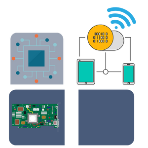

<p align="center">
  <a href="" rel="noopener">
 </a>
</p>

<h3 align="center">IoT Device Emulator</h3>

<div align="center">

[]()

</div>

---

<p align="center"> IoT Device Emulator
    <br> 
</p>

# 📝 Table of Contents

- [About](#about)
- [IoT Device Emulator](#sfms)
  - [Getting Started](#getting_started)
  - [Usage](#usage)
  - [Built Using](#built_using)
  - [Authors](#authors)


# 📜 About <a name = "about"></a>

This repo contains

- Python3 App
- Detailed instructions

<br><br>

#   IoT Device Emulator<a name = "sfms"></a>
## Getting Started <a name = "getting_started"></a>

These instructions will get you a copy of the project up and running on your system.

### Prerequisites

Things you need.

```
- Docker Environmnet
- CapRover(Optional but preferable)
```

### Installing <a name = "installing"></a>

A step by step series that tell you how to get the emulator running

#### Without Docker/Caprover

1.  Modify the `config.py` file according to your needs and execute the following commands.
2.  ```python
     pip3 install -r requirements.txt
     ```
3.  ```python
     python3 app.py
     ```
#### With Caprover

1.  Modify the `config.py` file according to your needs and execute the following command.
2.  `./genBackend.sh`
3.  Then upload the generated `iot-dem.tar` file to the CapRover as an app.

## Usage <a name = "usage"></a>

1.  `config.py` file contains the `SUB_TOPICS`, `PUB_PAYLOAD_CONFIG` and `PUB_PAYLOAD`

# ⛏️ Built Using <a name = "built_using"></a>


- [Python3](https://www.python.org/) - A Programming Language


# ✍️ Authors <a name = "authors"></a>

- [@Nauman3S](https://github.com/Nauman3S) - Development and Deployment
